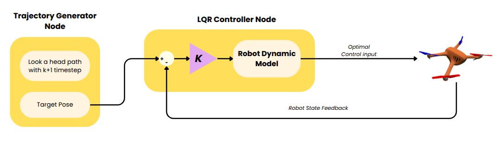
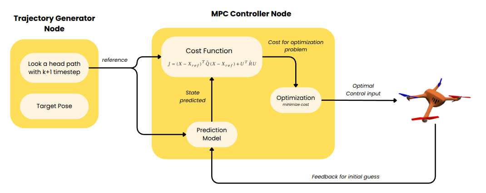
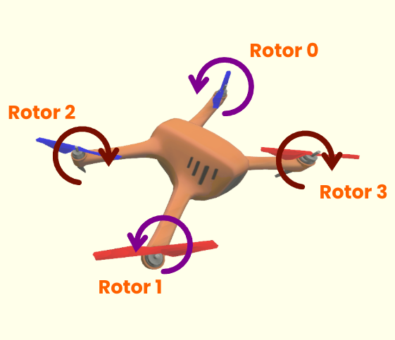
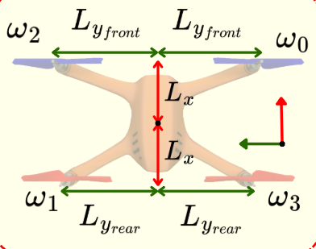
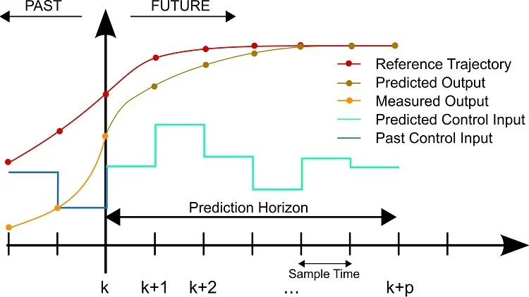

# Quadrotor Control Project: Optimal & Predictive Control

This project explores the design and implementation of advanced control strategies for a quadrotor in Gazebo simulation environment. It covers **Linear Quadratic Regulator (LQR)** and **Model Predictive Control (MPC)**.

## 1. System Architecture
The system architecture follows a closed-loop control paradigm integrated with the Gazebo simulation environment. It consists of a high-level controller (LQR or MPC) that processes the error between a reference trajectory and the current state feedback to compute optimal control commands.

- **Gazebo Plant**: Simulates the nonlinear quadrotor physics and provides real-time state estimation (position, orientation, and velocities) back to the controller.

- **LQR Architecture**: Implements a static gain matrix $K$ derived from the linearized system dynamics to provide optimal regulation around the hover equilibrium.

- **MPC Architecture**: Utilizes a receding horizon strategy, solving a constrained optimization problem at each time step to predict future states and generate optimal control sequences.

## 2. Dynamic Modeling & Linearization

The quadrotor is a nonlinear system. For linear control, we linearize it around the **hover equilibrium**.

### Full Nonlinear Dynamics
Translational accelerations in the world frame ($\ddot{x}, \ddot{y}, \ddot{z}$) and angular accelerations in the body frame ($\ddot{\phi}, \ddot{\theta}, \ddot{\psi}$):
- $\ddot{x} = \frac{1}{m} (\cos\phi \sin\theta \cos\psi + \sin\phi \sin\psi) F_{total}$

- $\ddot{y} = \frac{1}{m} (\cos\phi \sin\theta \sin\psi - \sin\phi \cos\psi) F_{total}$

- $\ddot{z} = \frac{1}{m} (\cos\phi \cos\theta) F_{total} - g$

- $\ddot{\phi} = \frac{\tau_{roll}}{I_{xx}}$

- $\ddot{\theta} = \frac{\tau_{pitch}}{I_{yy}}$

- $\ddot{\psi} = \frac{\tau_{yaw}}{I_{zz}}$

### Linearized Dynamics Around Hover
Assuming small angles ($\phi, \theta, \psi \approx 0$) and $F_{total} \approx mg$:
- $\ddot{x} \approx g \cdot \theta$

- $\ddot{y} \approx -g \cdot \phi$

- $\ddot{z} \approx \frac{F_{total}}{m} - g$

- $\ddot{\phi} \approx \frac{\tau_{roll}}{I_{xx}}$

- $\ddot{\theta} \approx \frac{\tau_{pitch}}{I_{yy}}$

- $\ddot{\psi} \approx \frac{\tau_{yaw}}{I_{zz}}$

## 3. Drone Configuration & Parameters

The quadrotor follows an **X-configuration** with a standard **ENU (East-North-Up)** axis convention for the world frame.

### A. Coordinate System & Axis Layout
- **X-axis (Front)**: Directed towards the front of the drone (between Motor 0 and 2).
- **Y-axis (Left)**: Directed towards the left of the drone (between Motor 1 and 2).
- **Z-axis (Up)**: Directed upwards, perpendicular to the motor plane.
- **Roll ($\phi$)**: Rotation about the X-axis.
- **Pitch ($\theta$)**: Rotation about the Y-axis.
- **Yaw ($\psi$)**: Rotation about the Z-axis.

### B. Motor Layout

| Motor ID | Position | Rotation | Lever Arm ($L_x, L_y$) |
| :--- | :--- | :--- | :--- |
| **0** | Front-Right | CCW (+) | $0.13, -0.22$ |
| **1** | Rear-Left | CCW (+) | $-0.13, 0.20$ |
| **2** | Front-Left | CW (-) | $0.13, 0.22$ |
| **3** | Rear-Right | CW (-) | $-0.13, -0.20$ |

### C. Physical Parameters
The following values are used for dynamic modeling and control law computation from `robot_params.xacro` and `quadrotor_base.xacro`:

| Parameter | Symbol | Value | Units |
| :--- | :--- | :--- | :--- |
| Total Mass | $m$ | 1.525 | $kg$ |
| Gravity | $g$ | 9.81 | $m/s^2$ |
| Thrust Coefficient | $k_F$ | $8.54858 \times 10^{-6}$ | $N/(rad/s)^2$ |
| Torque Coefficient | $k_M$ | 0.06 | $N·m / N$ |
| Max Motor Speed | $\omega_{max}$ | 1500 | $rad/s$ |
| Roll Inertia | $I_{xx}$ | 0.0356547 | $kg·m^2$ |
| Pitch Inertia | $I_{yy}$ | 0.0705152 | $kg·m^2$ |
| Yaw Inertia | $I_{zz}$ | 0.0990924 | $kg·m^2$ |

---

### **Moment of Inertia Calculation**

Accurate physics modeling is crucial. The moments of inertia ($I_{xx}, I_{yy}, I_{zz}$) include the base link and the four rotors using the **Parallel Axis Theorem**:
$$I_{total} = I_{base} + \sum_{i=1}^{4} (I_{rotor, i} + m_{rotor} \cdot d_i^2)$$

**Final Calculated Values:**
- $I_{xx} = 0.0356547 kg·m²$
- $I_{yy} = 0.0705152 kg·m²$
- $I_{zz} = 0.0990924 kg·m²$

## 4. Motor Mixing

Control efforts $[F, \tau_r, \tau_p, \tau_y]$ are converted to motor speeds $\omega_i^2$ via the allocation matrix $\Gamma$:

$$
\begin{bmatrix} 
F \\ 
\tau_r \\ 
\tau_p \\ 
\tau_y 
\end{bmatrix} = 
\begin{bmatrix} 
k_F & k_F & k_F & k_F \\
-k_F \cdot L_{y_{front}} & k_F \cdot L_{y_{rear}} & k_F \cdot L_{y_{front}} & -k_F \cdot L_{y_{rear}} \\
-k_F \cdot L_x & k_F \cdot L_x & -k_F \cdot L_x & k_F \cdot L_x \\
-k_F \cdot k_M & -k_F \cdot k_M & k_F \cdot k_M & k_F \cdot k_M 
\end{bmatrix} 
\begin{bmatrix} \omega_0^2 \\ 
\omega_1^2 \\ 
\omega_2^2 \\ 
\omega_3^2 \end{bmatrix}
$$

*Note: $L_x=0.13, L_{y_{front}}=0.22, L_{y_{rear}}=0.20$ based on URDF geometry.*

## 5. Controller

### A. Linear Quadratic Regulator (LQR)
LQR is an optimal control method that minimizes a cost function $J$ to find the optimal gain matrix $K$. In this project, it is used for precise hover and position hold.

#### 1. Linearized State-Space Model
The system is modeled as $\dot{\mathbf{x}} = A\mathbf{x} + B\mathbf{u}$ linearized around the hover equilibrium ($\phi, \theta \approx 0, F_{total} \approx mg$):

$$
\begin{bmatrix} 
\dot{x} \\ \dot{y} \\ \dot{z} \\ \dot{\phi} \\ \dot{\theta} \\ \dot{\psi} \\ \ddot{x} \\ \ddot{y} \\ \ddot{z} \\ \ddot{\phi} \\ \ddot{\theta} \\ \ddot{\psi} 
\end{bmatrix} = 
\begin{bmatrix} 
0 & 0 & 0 & 0 & 0 & 0 & 1 & 0 & 0 & 0 & 0 & 0 \\
0 & 0 & 0 & 0 & 0 & 0 & 0 & 1 & 0 & 0 & 0 & 0 \\
0 & 0 & 0 & 0 & 0 & 0 & 0 & 0 & 1 & 0 & 0 & 0 \\
0 & 0 & 0 & 0 & 0 & 0 & 0 & 0 & 0 & 1 & 0 & 0 \\
0 & 0 & 0 & 0 & 0 & 0 & 0 & 0 & 0 & 0 & 1 & 0 \\
0 & 0 & 0 & 0 & 0 & 0 & 0 & 0 & 0 & 0 & 0 & 1 \\
0 & 0 & 0 & 0 & g & 0 & 0 & 0 & 0 & 0 & 0 & 0 \\
0 & 0 & 0 & -g & 0 & 0 & 0 & 0 & 0 & 0 & 0 & 0 \\
0 & 0 & 0 & 0 & 0 & 0 & 0 & 0 & 0 & 0 & 0 & 0 \\
0 & 0 & 0 & 0 & 0 & 0 & 0 & 0 & 0 & 0 & 0 & 0 \\
0 & 0 & 0 & 0 & 0 & 0 & 0 & 0 & 0 & 0 & 0 & 0 \\
0 & 0 & 0 & 0 & 0 & 0 & 0 & 0 & 0 & 0 & 0 & 0
\end{bmatrix} 
\begin{bmatrix} 
x \\ 
y \\ 
z \\ 
\phi \\ 
\theta \\ 
\psi \\ 
\dot{x} \\ 
\dot{y} \\ 
\dot{z} \\ 
\dot{\phi} \\ 
\dot{\theta} \\ 
\dot{\psi} 
\end{bmatrix} + 
\begin{bmatrix} 
0 & 0 & 0 & 0 \\
0 & 0 & 0 & 0 \\
0 & 0 & 0 & 0 \\
0 & 0 & 0 & 0 \\
0 & 0 & 0 & 0 \\
0 & 0 & 0 & 0 \\
0 & 0 & 0 & 0 \\
0 & 0 & 0 & 0 \\
1/m & 0 & 0 & 0 \\
0 & 1/I_{xx} & 0 & 0 \\
0 & 0 & 1/I_{yy} & 0 \\
0 & 0 & 0 & 1/I_{zz}
\end{bmatrix} 
\begin{bmatrix} 
dF \\ 
\tau_{roll} \\ 
\tau_{pitch} \\ 
\tau_{yaw} 
\end{bmatrix}
$$

*   **State Vector ($\mathbf{x}$)**: $[x, y, z, \phi, \theta, \psi, \dot{x}, \dot{y}, \dot{z}, \dot{\phi}, \dot{\theta}, \dot{\psi}]^T$
*   **Input Vector ($\mathbf{u}$)**: $[dF, \tau_r, \tau_p, \tau_y]^T$ where $dF = F_{total} - mg$.

#### 2. Weight Design (Q & R Matrices)
The controller minimizes $J = \int_{0}^{\infty} (\mathbf{x}^T Q \mathbf{x} + \mathbf{u}^T R \mathbf{u}) dt$ with the following weights:
- **$Q$ Matrix (State Cost)**: Penalizes deviations from the reference trajectory. We prioritize $X, Y$ position tracking for accuracy, followed by velocities and attitudes.
- **$R$ Matrix (Input Cost)**: Penalizes large control inputs to ensure smooth behavior and prevent motor saturation. High torque penalties reduce high-frequency jitter.

#### 3. Key Features
*   **Body-Heading Transform**: World-frame errors are rotated into the drone's body-heading frame, ensuring stability at any yaw angle.
*   **Wind Robust Tuning**: High velocity damping and torque penalty ($R_{roll, pitch} = 5.0$ in some versions) are used to prevent simulation jitter under 4 m/s wind.
*   **Optimal Control**: Solves the Algebraic Riccati Equation (ARE) offline to obtain the gain matrix $K$.

#### 4. Implementation Procedure
The LQR controller in `LQR.py` is implemented through the following systematic steps:

1.  **Define Physical Parameters**: Extract mass ($m$), gravity ($g$), and moments of inertia ($I_{xx}, I_{yy}, I_{zz}$) from the URDF/Xacro files.
2.  **Build Linearized Model**: Construct state matrix $A$ and input matrix $B$ by linearizing dynamics around the hover point.
3.  **Define Cost Matrices ($Q$ & $R$)**: Assign weights to penalize state errors and control effort respectively.
4.  **Solve Algebraic Riccati Equation (ARE)**: Compute the unique positive-definite matrix $P$ using `scipy.linalg.solve_continuous_are`:
    $$A^T P + PA - PBR^{-1}B^T P + Q = 0$$
5.  **Compute Optimal Gain ($K$)**: Calculate the gain matrix as $K = R^{-1} B^T P$.
6.  **Apply Control Law**: Compute the control correction $\mathbf{u}_{corr} = K \cdot (\mathbf{x}_{ref} - \mathbf{x}_{current})$ and add it to the hover trim $\mathbf{u}_{hover}$.
7.  **Motor Mixing**: Map the control inputs $[F, \tau_r, \tau_p, \tau_y]$ to individual motor speeds using $\Gamma^{-1}$.

### B. Model Predictive Control (MPC)

The MPC node solves a constrained optimization problem at every time step ($DT=0.01s$) to find the optimal control sequence that tracks a future reference path.

---

**1. Optimal Control for MPC**

**1.1 Problem Setup**

Consider the discrete-time linear system

$$
x_{k+1} = A x_k + B u_k
$$

where

- $x_k \in \mathbb{R}^n$ is the state
- $u_k \in \mathbb{R}^m$ is the control input
- $A \in \mathbb{R}^{n \times n}$
- $B \in \mathbb{R}^{n \times m}$

In finite-horizon Model Predictive Control (MPC), at time $k$ we solve an optimization problem over a prediction horizon of length $N$.

We define

$$
x_0 := x(k)
$$

to minimize a quadratic cost while satisfying system dynamics and constraints.

---

**1.2 Quadratic Cost Function**

The standard finite-horizon quadratic cost is

$$
J = \sum_{i=0}^{N-1} \left( x_i^T Q x_i + u_i^T R u_i \right) + x_N^T P x_N
$$

where

- $Q \succeq 0$ is the stage state cost
- $R \succ 0$ is the stage input cost
- $P \succeq 0$ is the terminal state cost

This cost penalizes:

- large state deviations through $Q$
- large control effort through $R$
- terminal error through $P$

---

**1.3 Finite-Horizon Prediction Model**

Using the dynamics recursively,

$$
x_1 = A x_0 + B u_0
$$

$$
x_2 = A x_1 + B u_1 = A^2 x_0 + A B u_0 + B u_1
$$

$$
x_3 = A x_2 + B u_2 = A^3 x_0 + A^2 B u_0 + A B u_1 + B u_2
$$

In general,

$$
x_i = A^i x_0 + \sum_{j=0}^{i-1} A^{i-1-j} B u_j
$$

Now stack all predicted states into one vector:

$$
X =
\begin{bmatrix}
x_1 \\
x_2 \\
\vdots \\
x_N
\end{bmatrix}
\in \mathbb{R}^{nN}
$$

as the current measured state, and optimize the future control sequence

$$
U =
\begin{bmatrix}
u_0 \\
u_1 \\
\vdots \\
u_{N-1}
\end{bmatrix}
\in \mathbb{R}^{mN}
$$

Then the stacked prediction model can be written as

$$
X = \mathcal{A} x_0 + \mathcal{B} U
$$

with

$$
\mathcal{A} =
\begin{bmatrix}
A \\
A^2 \\
\vdots \\
A^N
\end{bmatrix}
\in \mathbb{R}^{nN \times n}
$$

and

$$
\mathcal{B} =
\begin{bmatrix}
B & 0 & 0 & \cdots & 0 \\
AB & B & 0 & \cdots & 0 \\
A^2B & AB & B & \cdots & 0 \\
\vdots & \vdots & \vdots & \ddots & \vdots \\
A^{N-1}B & A^{N-2}B & A^{N-3}B & \cdots & B
\end{bmatrix}
\in \mathbb{R}^{nN \times mN}
$$

---

**1.4 Rearranging the Cost into Matrix Form**

To write the cost compactly, define the stacked weighting matrices

$$
\bar{Q} =
\begin{bmatrix}
Q      & 0      & \cdots & 0 \\
0      & Q      & \cdots & 0 \\
\vdots & \vdots & \ddots & \vdots \\
0      & 0      & \cdots & P
\end{bmatrix}
\in \mathbb{R}^{nN \times nN}
$$

and

$$
\bar{R} =
\begin{bmatrix}
R      & 0      & \cdots & 0 \\
0      & R      & \cdots & 0 \\
\vdots & \vdots & \ddots & \vdots \\
0      & 0      & \cdots & R
\end{bmatrix}
\in \mathbb{R}^{mN \times mN}
$$

Then the cost becomes

$$
J = X^T \bar{Q} X + U^T \bar{R} U
$$

Substitute the prediction model $X = \mathcal{A}x_0 + \mathcal{B}U$:

$$
J = (\mathcal{A}x_0 + \mathcal{B}U)^T \bar{Q} (\mathcal{A}x_0 + \mathcal{B}U) + U^T \bar{R}U
$$

Expand:

$$
J = x_0^T \mathcal{A}^T \bar{Q} \mathcal{A} x_0 + 2 x_0^T \mathcal{A}^T \bar{Q} \mathcal{B} U + U^T \mathcal{B}^T \bar{Q} \mathcal{B} U + U^T \bar{R}U
$$

Group the terms in $U$:

$$
J = U^T H U + 2 F^T U + c
$$

where

$$
H = \mathcal{B}^T \bar{Q} \mathcal{B} + \bar{R}
$$

$$
F = \mathcal{B}^T \bar{Q} \mathcal{A} x_0
$$

$$
c = x_0^T \mathcal{A}^T \bar{Q} \mathcal{A} x_0
$$

Since $c$ does not depend on $U$, it can be ignored during optimization. Therefore the finite-horizon MPC problem becomes

$$
\min_U \quad U^T H U + 2 F^T U
$$

or equivalently, in standard quadratic programming form,

$$
\min_U \quad \frac{1}{2} U^T (2H) U + (2F)^T U
$$

---

**1.5 Error-State Formulation and Minimization**
Current quadratic cost function is minimizing state and control input, but we want to minimize error along the trajectory

$$
J = (X-X_{ref})^T\bar{Q}(X-X_{ref}) + U^T\bar{R}U
$$

Substitute the prediction model

$$
X = \mathcal{A}x_0 + \mathcal{B}U
$$

Then

$$
J =
(\mathcal{A}x_0 + \mathcal{B}U - X_{ref})^T
\bar{Q}
(\mathcal{A}x_0 + \mathcal{B}U - X_{ref})
+
U^T\bar{R}U
$$

Expand the quadratic term

$$
J =
(\mathcal{A}x_0-X_{ref})^T\bar{Q}(\mathcal{A}x_0-X_{ref})
+
2U^T\mathcal{B}^T\bar{Q}(\mathcal{A}x_0-X_{ref})
+
U^T\mathcal{B}^T\bar{Q}\mathcal{B}U
+
U^T\bar{R}U
$$

Group terms in \(U\)

$$
J =
U^T(\mathcal{B}^T\bar{Q}\mathcal{B}+\bar{R})U
+
2U^T\mathcal{B}^T\bar{Q}(\mathcal{A}x_0-X_{ref})
+
(\mathcal{A}x_0-X_{ref})^T\bar{Q}(\mathcal{A}x_0-X_{ref})
$$

Let

$$
H = \mathcal{B}^T\bar{Q}\mathcal{B}+\bar{R}
$$

$$
F = \mathcal{B}^T\bar{Q}(\mathcal{A}x_0-X_{ref})
$$

Then

$$
J = U^THU + 2U^TF + c
$$

---

#### Partial derivative w.r.t \(U\)

$$\frac{\partial J}{\partial U}=2HU + 2F$$

Set gradient to zero

$$
2HU + 2F = 0
$$

$$
HU + F = 0
$$

Optimal control sequence

$$
U^* = -H^{-1}F
$$

Substitute back

$$
U^* = - (\mathcal{B}^T\bar{Q}\mathcal{B}+\bar{R})^{-1} \mathcal{B}^T\bar{Q}(\mathcal{A}x_0-X_{ref})
$$

- $U^{*}$ is our optimal control input

> Special Thanks, reference : https://www.youtube.com/watch?v=6GSHAoLMsXs&list=PLg6FTHy3zJjzJ8Ddui6ZwQpdMZeoqG1ei

---

#### **2. Model Predictive Control Concept**

MPC works by predicting future system behavior using a model, optimizing a sequence of control inputs over a finite horizon, and applying only the first input before repeating the process. Then update the model, using the state in current time step as the initial guess for the open loop prediction. The two key ideas involved are open-loop prediction and the distinction between prediction horizon and control horizon.

  

**Prediction Horizon**
- The prediction horizon ​$N_p$  efines the number of future time steps over which the system states are predicted using the model
- The model simulates the future system behavior over ​$N_p$ steps assuming a sequence of future control inputs.

$$x_{k+1}, x_{k+2} , x_{k+3} , \dots, x_{k+N_{p}}$$

The optimizer minimizes a cost function defined over these predicted states.

**Control Horizon**
- The control horizon ​$N_c$ defines the number of independent control inputs optimized by the controller.

$$N_{c} \le N_{p}$$

- After $N_c$ , the control input is usually held constant for the remaining prediction horizon:

$$u_{k+i} = u_{k+N_{c}-1}, i \ge N_{c}$$
---

#### 3. Weight Design ($Q$ and $R$ Matrices)
The performance of the MPC is heavily influenced by the weight matrices:
- **$Q$ Matrix (State Cost)**: Penalizes deviations from the reference trajectory. We prioritize $X, Y$ position tracking for accuracy, followed by velocities and attitudes.
- **$R$ Matrix (Input Cost)**: Penalizes large control inputs to ensure smooth behavior and prevent motor saturation. High torque penalties reduce high-frequency jitter.
- **$Q_N$ (Terminal Cost)**: Penalizes the error at the end of the horizon, typically scaled higher ($5.0\times$) to ensure stability.

#### 4. Key Features
- **Lookahead Horizon**: $N=20$ steps with $DT=0.05s$ provides a **1.0-second** lookahead window, allowing the drone to anticipate turns.
- **Constrained Optimization**: Control inputs are strictly bounded to physical limits:
  - Total Thrust: $[0, 4mg]$
  - Torques: $\tau_{roll/pitch} \in [-8, 8]$, $\tau_{yaw} \in [-3, 3]$
- **Numerical Stability**:
  - **Hessian Normalization**: Normalizes $H$ by its trace to improve solver convergence (L-BFGS-B).
  - **Warm-Start**: The previous optimal control sequence is shifted and used as the initial guess for the next step.

#### 5. Implementation Procedure
1. **Discrete Modeling**: Convert the continuous-time $(A, B)$ matrices to discrete-time $(A_d, B_d)$ using Zero-Order Hold (ZOH).
2. **Prediction Matrix Construction**: Build the stacked matrices $\mathcal{A}$ and $\mathcal{B}$ that map the current state and future controls to the predicted state trajectory.
3. **QP Matrix Formulation**: Formulate the quadratic cost $J = U^T H U + 2 F^T U$ by calculating the Hessian $H$ and linear term $F$ offline/online.
4. **Reference Building**: Extract $N$ future states from the `/reference_path` topic.
5. **Optimization**: Solve the constrained QP problem at **20 Hz** using the L-BFGS-B algorithm.
6. **Actuation**: Apply the first control chunk $u_0$ and repeat.

## 6. Test Trajectories

The `send_trajectory_2.py` utility provides several predefined patterns for testing controller performance. These trajectories generate a time-sequenced `nav_msgs/Path` for controlling drone.

### A. Trajectory Types

| Mode | Description | Key Parameters |
| :--- | :--- | :--- |
| **HOVER** | Holds a fixed position at a specific altitude. | $z$ |
| **LIN_1D_X** | Linear motion along the X-axis. | $x_{min}, x_{max}, speed$ |
| **LIN_1D_Z** | Linear motion along the Z-axis. | $z_{min}, z_{max}, speed$ |
| **LIN_2D** | Linear motion along the X-Z plane. | $point_{start}, point_{end}, speed$ |
| **SINE** | A sinusoidal wave along the X-axis in the X-Z plane. | $amplitude, frequency, num\_wave, speed$ |
| **LIN_3D** | A linear point-to-point path in 3D space. | $point_{start}, point_{end}, speed$ |
| **HELIX** | A 3D helical upward path. | $radius, turns, height, speed$ |

### B. Features
- **Lookahead Path**: Generates $N=20$ future poses (spaced at $DT=0.05s$) for predictive control (MPC).
- **Round-Trip**: Can be configured to traverse waypoints in reverse back to the start.
- **Yaw Alignment**: Automatically orients the drone's heading ($yaw$) to face the direction of motion.
- **Speed-Based**: Segment durations are calculated dynamically based on a constant target speed (m/s).

## 7. Performance Metrics & Visualization

To evaluate and compare the performance of different controllers (LQR, MPC), we use the following quantitative metrics and visualization strategies.

### A. Performance Metrics
We measure the error between the reference trajectory $\mathbf{x}_{ref}(t)$ and the actual state $\mathbf{x}(t)$.

- **Mean Absolute Error (MAE)**: Measures the average magnitude of the errors.
  $$MAE = \frac{1}{T} \int_{0}^{T} |e(t)| dt$$
- **Peak Error ($e_{max}$)**: Maximum deviation from the path, critical for obstacle avoidance.
  $$e_{max} = \max |e(t)|$$

### B. Visualization Strategies
- **State-over-Time**: Individual plots for $X, Y, Z$ to identify which axes are most susceptible to disturbances.
- **Control Input Monitoring**: Visualization of $F_{total}$ and $\tau$ to ensure the controller is not saturating the motors or causing high-frequency jitter (over-tuning).
- **Cumulative Error**: The total accumulated error over the entire trajectory duration, reflecting the overall tracking performance.
  $$E_{total} = \int_{0}^{T} |e(t)| dt$$

## 8. Results & Summary

Soon

## Author
- 65340500037 Pavaris Asawakijtananont
- 65340500058 Anuwit Intet
---